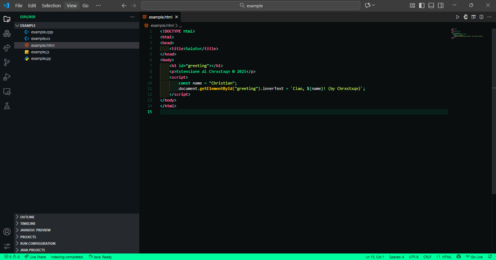
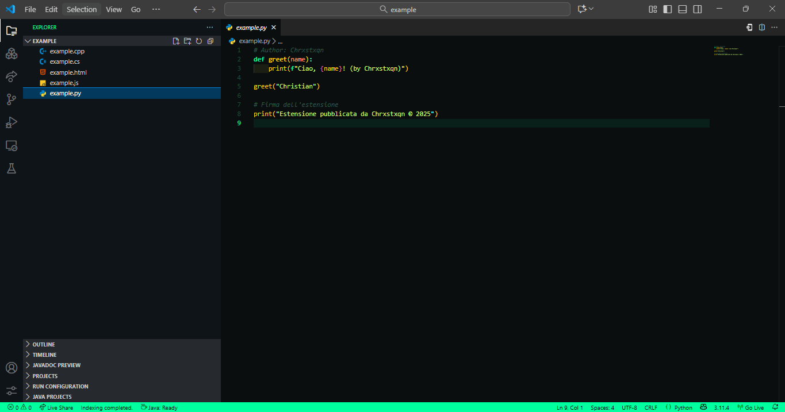
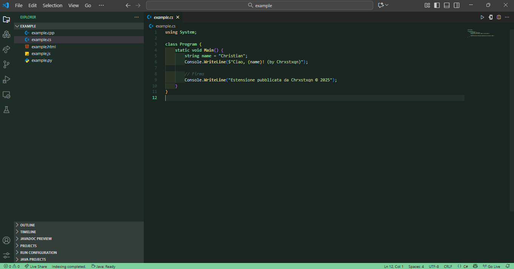
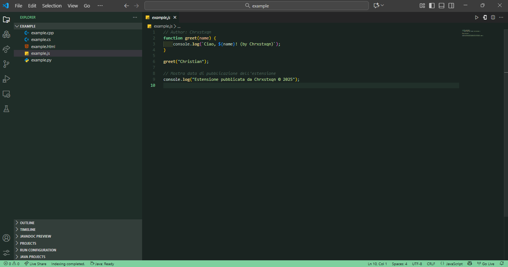

# NeoMint Dark Theme

A modern VS Code dark theme with elegant mint-green highlights that brings a fresh, professional look to your coding environment.

## ✨ Features

* **Modern Dark Interface**: Carefully crafted dark background that's easy on the eyes
* **Mint-Green Accents**: Beautiful mint-green highlights for keywords, strings, and important elements
* **Two Variants**:

  * **NeoMint Dark**: Bold contrast for maximum readability
  * **NeoMint Soft**: Softer colors for extended coding sessions
* **Syntax Highlighting**: Optimized for popular languages including JavaScript, TypeScript, Python, Java, C++, and more
* **UI Integration**: Consistent theming across the entire VS Code interface

## 🚀 Installation

### Via VS Code Marketplace (Recommended)

1. Open VS Code
2. Go to Extensions (`Ctrl+Shift+X` or `Cmd+Shift+X`)
3. Search for "NeoMint Dark"
4. Click Install
5. Go to `File > Preferences > Theme > Color Theme` and select either:

   * **NeoMint Dark** (for high contrast)
   * **NeoMint Soft** (for softer appearance)

### Manual Installation

1. Download this repository
2. Copy the folder to `~/.vscode/extensions/`
3. Restart VS Code
4. Select the theme from the color theme picker

## 🎨 Theme Variants

### NeoMint Dark

The original high-contrast version with vibrant mint-green accents, perfect for focused coding sessions.

#### Screenshots - Dark

  
  

### NeoMint Soft

A gentler variant with softer colors and reduced contrast, ideal for long coding sessions and late-night development.

#### Screenshots - Soft

  
  

## 🛠️ Optimized For

* JavaScript/TypeScript
* React/Vue/Angular
* Python
* Java
* C/C++
* HTML/CSS/SCSS
* JSON/YAML
* Markdown
* And many more!

## 🤝 Contributing

Found a bug or have a suggestion? Feel free to:

* Open an issue on GitHub
* Submit a pull request
* Share your feedback

## 📝 License

This theme is open source and available under the [MIT License](LICENSE).

## 🌟 Show Your Support

If you enjoy using NeoMint Dark, please consider:

* ⭐ Starring this repository
* 📝 Leaving a review on the VS Code Marketplace
* 🐛 Reporting any issues you find

---

**Created with ❤️ by [Chrxstxqn](https://github.com/Chrxstxqn)**

*Happy coding! 🚀*